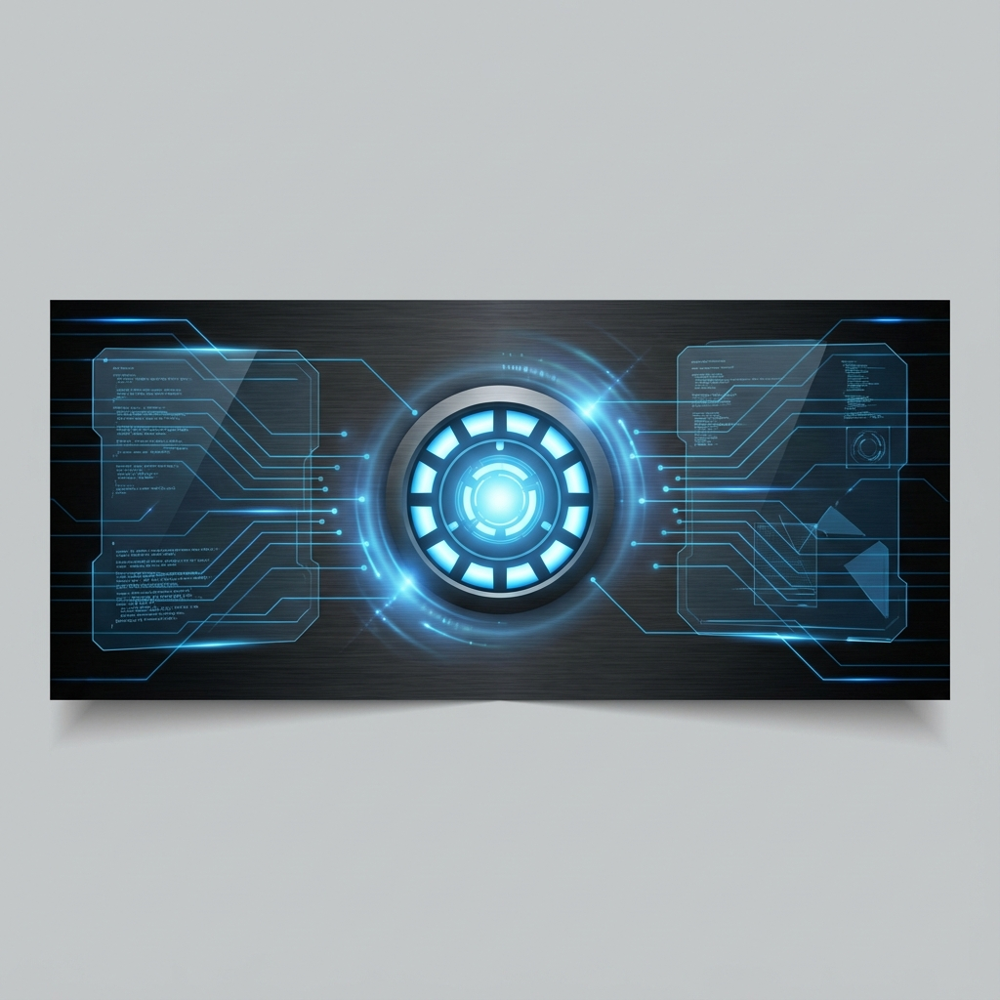

# 🤖 JARVIS: The Ultimate Software Architect AI



> "Sir, I've updated the protocols. We are ready to build."

**JARVIS** (Just A Rather Very Intelligent System) is a futuristic, state-of-the-art AI workspace designed for senior software architects and developers. Inspired by the iconic Iron Man interface, JARVIS combines a premium "Stark-grade" UI with powerful multi-modal AI reasoning to transform how you design, build, and debug software.

---

## ⚡ Key Features

### 🏛️ Architect Protocol
JARVIS isn't just a chatbot. When the **Architect Protocol** is engaged, the system transitions into a senior software engineering lead persona, prioritizing:
- **Structural Integrity**: Focus on design patterns and clean architecture.
- **Scalability**: Anticipating future growth and bottlenecks.
- **Best Practices**: Enforcing industry-standard coding conventions.

### ⚛️ Animated Arc Reactor UI
A breathtaking, CSS-driven animated Arc Reactor serves as the system's heartbeat, pulsing in sync with AI reasoning cycles. The interface features:
- **Holographic Panels**: Glassmorphic UI elements with neon accents.
- **Glitch Effects**: Cybernetic transitions and interactive micro-animations.
- **System Diagnostics**: Real-time status indicators and terminal feedback.

### 💾 Cognitive Memory System
JARVIS tracks your project's context across sessions:
- **Fact Storage**: Automatically remembers your preferences and project requirements.
- **Conversation Summarization**: Keeps context windows lean and efficient.
- **Local Persistence**: Integrated with local storage for seamless workflow continuity.

### 🖥️ Specialized Workspace
- **Terminal Interface**: A high-tech command center for interacting with the AI with real-time markdown rendering and syntax highlighting.
- **Code Architect Panel**: A split-screen environment featuring an integrated **Monaco Editor**. JARVIS **automatically extracts code blocks** from conversations and syncs them to this panel for a seamless transition from chat to development.
- **Voice Protocol**: Integrated **Web Speech API** for hands-free command input. Toggle the voice recognition to communicate with JARVIS naturally.
- **Identity Gate**: A futuristic authentication layer ensuring secure access to your AI protocols.

---

## 🛠️ Technology Stack

- **Framework**: [React 19](https://react.dev/) + [Vite](https://vitejs.dev/)
- **Styling**: [Tailwind CSS](https://tailwindcss.com/) + [Framer Motion](https://www.framer.com/motion/)
- **AI Core**: [Groq SDK](https://wow.groq.com/) (LLaMA-3 / Mixtral Integration)
- **Editor**: [@monaco-editor/react](https://github.com/sureskon/monaco-react)
- **Icons**: [Lucide React](https://lucide.dev/)
- **Animations**: Custom CSS Keyframes + Framer Motion Spring Dynamics

---

## 🚀 Getting Started

### 1. Prerequisites
- Node.js (v18 or higher)
- A Groq API Key (Sign up at [Groq Cloud](https://console.groq.com/))

### 2. Installation
```bash
# Clone the repository
git clone https://github.com/your-username/jarvis.git

# Navigate to the project
cd jarvis

# Install dependencies
npm install
```

### 3. Configuration
Create a `.env` file in the root directory and add your credentials:
```env
VITE_GROQ_API_KEY=your_api_key_here
```

### 4. Launch JARVIS
```bash
npm run dev
```

---

## 📂 Project Structure

```text
src/
├── components/          # UI Modules (ArcReactor, Terminal, etc.)
│   ├── ArcReactor.jsx   # The visual heartbeat
│   ├── CodeArchitect.jsx # Main workspace component
│   └── IdentityGate.jsx  # Security & Auth UI
├── lib/                 # Core Logic
│   └── memory.js        # Cognitive memory management
├── hooks/               # Custom React Hooks
└── assets/              # Static resources & styles
```

---

## 🛡️ License
This project is licensed under the MIT License - see the [LICENSE](LICENSE) file for details.

---

